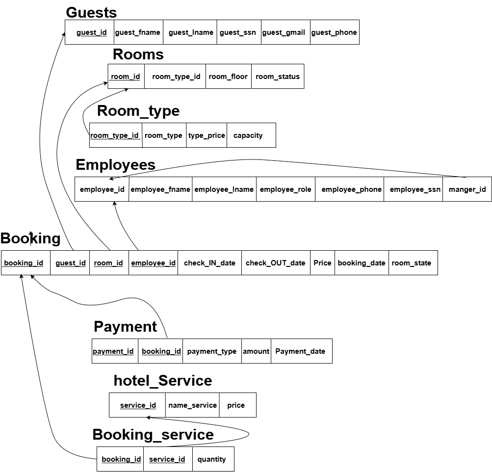

# 🏨 ROOM207 - Hotel Management System

<p align="center">
  
  
  
  
  
</p>

---

**ROOM207** is a database-driven project that demonstrates database design,
SQL queries execution, and frontend interaction.
It includes ER diagrams, mapping, SQL scripts, and a Jupyter notebook for database connection and testing.

---

## 🚀 Key Features
-  Well-structured ER Diagram representing the database entities and relationships
-  ER to Relational Mapping following database design rules
-  Comprehensive Data Dictionary for tables and attributes
-  SQL Queries for data retrieval and manipulation
-  Secure database connection using environment variables
-  Simple frontend interface for interacting with the database
-  Organized project structure for easy navigation and maintenance

---

## 🛠 Tech Stack
- **Database:** SQL Server  
- **Query Language:** SQL  
- **Backend / Connection:** Python (Jupyter Notebook)  
- **Frontend:** HTML , css , js  
- **Environment Management:** `.env` file  

---

## 📂 Project Structure

```bash
ROOM207/
│
├── ER_Diagram/              # Entity Relationship Diagram
├── Mapping/                 # ER to Relational Mapping
├── Queries/                 # SQL queries
│   ├── SQLQuery1.sql
│   ├── SQLQuery2.sql
│   └── SQLQuery3.sql
├── templates/               # HTML templates
│   └── Frontend.html
├── connection.ipynb         # Database connection & testing notebook
├── .env                     # Environment variables (local only)
└── .gitignore               # Files excluded from version control
```

---

## ER Diagram
The ER Diagram above illustrates the main entities of the ROOM207 system and their relationships. Each table, primary key, and foreign key is clearly represented.


---

## Mapping
The Relational Mapping diagram shows how the ER Diagram entities are converted into SQL tables, including table names, columns, and relationships between them.


---

## ⚙️ How to Run

### 1-Clone the repository
```
git clone https://github.com/rowannhussein86/ROOM207
```

### 2-Set up the environment variables
Create a .env file and add your database connection details (such as server name, database name, username, and password).

### 3-Connect to the database
Open connection.ipynb and run the cells to establish a connection with the SQL Server database.

### 4-Run SQL queries
Execute the provided SQL queries either directly in SQL Server or through the Jupyter Notebook to interact with the database.

---

## 🖼️ Frontend Preview

